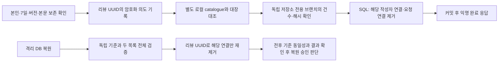

# 리뷰 배포 준비 — 개발 4주차(2026-09-07~09-13)

2026-09-12 검토 초안. 운영 배포·DB 적용·리뷰 활성화 승인이 아니다.

## 단건 작성자 연결 해제 보호 후보

- V12에 변경 불가능한 `review_key` UUID를 추가했다. 백업 시점 이후 숫자 ID가 재사용되더라도 다른 리뷰를 지우지 않는다. V12는 아직 운영 미적용 후보다.
- 기록은 버전·고정 용도·리뷰 UUID만 포함하며 회원 ID·닉네임·시설·본문·현재 위치를 포함하지 않는다. 파일명에는 UUID가 있다. 완전 익명 정보라고 표현하지 않는다.
- 국내 LOCAL 암호화 저장소와 기존 키 체계를 재사용하되 **회원 파기 대장과 다른 디렉터리/용도**다. R2를 다시 사용하지 않는다.
- 기존 독립 검증 저장소의 새 `review-anonymization-v1` orphan 브랜치에는 건수·해시·세대만 기록하도록 후보 코드를 분리했다. 회원 파기 main/history는 수정하지 않는다. 실제 브랜치 생성과 0건 기준 초기화는 아직 하지 않았다.
- 임의의 빈 기준 생성·전체 유실을 0건으로 해석·다른 미완료 요청의 덮어쓰기·본문/리뷰 삭제는 하지 않는다. 불확실하면 작성자 연결 제거를 보류한다.
- 승인된 연결 해제 의도 저장 후 SQL이 롤백되면 의도는 남을 수 있다. 이후 검증된 복원/재시도에서 이미 요청한 연결 해제를 완료할 수 있다. 실패 응답을 성공으로 표시하지 않는다.
- `ReviewUnlinkRestore`는 검증된 snapshot만 받아 오프라인 DB에서 재처리한다. **기존 실제 복원 실행기에 연결·설치한 상태는 아니다.** 전후 snapshot/DB 세대/서비스 재개 차단과 기존 복원 경로의 통합 검증이 남아 있다.
- `REVIEW_UNLINK_ENABLED`, `REVIEW_UNLINK_LOCAL_VERIFIED`, `REVIEW_GUARD_CLEANUP_ENABLED` 기본값은 모두 false. `REVIEWS_ENABLED`도 기본 false를 유지한다.

## 만료 제한 정보

기존 신규 리뷰 등록 시 해당 사용자의 지난 24시간 제한 정보를 정리한다. 비활성 사용자에게 남은 만료 행도 처리할 수 있도록 기본 OFF인 정기 정리 후보를 추가했다. 5분 간격·회당 최대 1,000행이며 삭제 직전 만료 조건을 다시 검사한다. 운영 적용 전 API에서 실행할지 배치로 이관할지 배포 구성과 함께 확정한다. 리뷰·본문·평가·회원·제보·감사 이력은 삭제 대상이 아니다.

## 이번 로컬 검사

- 보호 기록의 중복·저장 실패·부분 기록·응답 유실·양쪽 목록 유실·키/세대 오류·잠금 실패·암호문 변조, 전용 브랜치 경로 제한.
- 복원 시 UUID 선택·없는 리뷰 구별·반복 적용·본문/평가 보존.
- 서비스가 권한/기한/버전/명시 확인 후에만 기록하는 순서, 기록 실패 시 SQL 유지, SQL 롤백 시 의도 잔존.
- 만료 경계·1,000건 상한·미만료 제한 및 리뷰 본문 보존.

메모리 저장소/H2와 로컬 테스트 결과이며 실제 독립 GitHub·Linux 영속 저장소·운영 복원 실행기까지 완료한 결과가 아니다. 기존 [HTTP/MySQL 검증](review-isolated-http-verification.md)은 그 문서에 적힌 이전 커밋의 결과로 구분한다.

## 임시 아이폰 프리뷰

승인 범위는 가상 계정·신규 시험 DB뿐이다. 시험 클래스 경로에서만 API를 실행하고 loopback MySQL datadir/marker를 검증한 뒤 새 스키마를 만든다. 실제 OAuth와 운영 refresh 저장소는 사용하지 않는다.

전달 경로는 preview 전용 Worker → 한시적 HTTPS 터널 → loopback 시험 gateway → 실제 리뷰 Spring API → 시험 MySQL이다. gateway는 리뷰/가상 지도/시험 계정 조회만 허용하며 실제 쿠키·Authorization은 버린다. 시험용 JWT는 gateway에서만 사용하고 브라우저에 전달하지 않는다. 원래 브라우저 GPS를 조작하지 않는다. 리뷰 시설의 시험 좌표만 별도 환경으로 지정한다.

최대 2시간 후 접근을 종료하며 검증 후 이번 시험 자원만 정리한다. 시험용 API/DB를 운영과 같은 서버로 부르거나 실제 OAuth 인수를 완료했다고 표시하지 않는다. 자유글에는 개인정보가 아닌 시험 문구만 입력한다.

2026-09-12 인수에서는 아이폰으로 작성·수정·작성자 정보 지우기를 완료했다. 최종 조회 결과 수정 버전이 유지됐고, 작성자 연결 해제 후 내 리뷰에서는 제외됐으며 공개 리뷰의 평가 항목은 보존되고 작성자만 `익명`으로 바뀌었다. 아이폰 시험에서는 자유글을 입력하지 않았으므로 자유글 보존은 실제 Spring API/MySQL을 사용한 별도 합성 자동 시험 결과로 보완했다. 390px 자동 브라우저에서는 자유글 작성·새로고침 재조회·수정·익명 처리 후 본문 보존, 가로 넘침 없음, 운영 API 미호출을 확인했다.

인수 직후 한시적 터널·시험 API·시험 DB와 약 176MB의 정확한 시험 디렉터리를 정리했다. preview Worker는 검증 전 디자인 프리뷰 버전으로 복원했고 시험 API 경로가 404인 것을 확인했다. 이 결과는 운영 리뷰 기능이나 운영 DB를 활성화했다는 뜻이 아니다.

## 운영 전 남은 문턱

- [x] 새 후보 전체 CI·Docker MySQL, 새 변경의 실제 HTTP/MySQL 회귀.
- [x] 임시 프리뷰 게시와 아이폰 실제 위치/새로고침/수정/익명 처리 인수 및 시험 자원 정리.
- [ ] 전용 기록 초기화·실제 복원 도구 통합·격리 중단/재개 시험 및 검토.
- [ ] 자유글 보존/위치 목적 고지와 개인정보 요청 처리 절차 초안 검토(정책 후속 WBS). 공개·시행은 별도 확인.
- [ ] 운영 활성화용 웹 빌드 게이트 및 API/배치 실행 설정 확정, DDL·복원 호환·중지/되돌림 절차 검토.
- [ ] 그 후 main 병합·운영 DDL·순차 배포·활성화 승인.

중지 시 리뷰 쓰기부터 OFF로 하고 기존 회원 기능·제보·로그·백업을 삭제하거나 끄지 않는다. V12 테이블을 DROP하는 식의 되돌림은 금지한다. 저장된 리뷰는 보존하고 코드/기능 플래그만 안전한 버전으로 되돌리는 것을 기본으로 한다.
